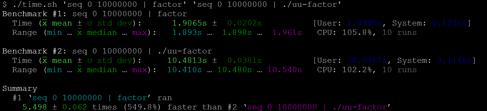

# Benchmarking Tool
Linux Benchmarking Tool

Copyright © 2020 Teal Dulcet

A port of the [hyperfine](https://github.com/sharkdp/hyperfine) Benchmarking Tool to Bash.

* Does NOT require installing Rust, downloading dependencies or compiling anything.
* Includes the [same features](https://github.com/sharkdp/hyperfine#features) (except Linux only), produces the same output (with some improvements) and supports most of the same command line options.
* Outputs most of the numbers with greater precision and outputs more information.
* Supports outputting in ASCII only (no Unicode characters) to support older terminals.
* Slightly faster when interactive output (the progress bar) is disabled, as it does not need to launch intermediate shells.

❤️ Please visit [tealdulcet.com](https://www.tealdulcet.com/) to support this script and my other software development.


Benchmark of the GNU [factor](https://www.gnu.org/software/coreutils/manual/html_node/factor-invocation.html) and uutils [factor](https://github.com/uutils/coreutils) commands.

Also see the [Testing and Benchmarking](https://github.com/tdulcet/Testing-and-Benchmarking-Scripts) scripts.

## Usage

Run: `./time.sh [OPTIONS] <command(s)>...`\
All the options can also be set by opening the script in an editor and setting the variables at the top. See [Help](#help) below for full usage information.

1. Download the script ([time.sh](time.sh)). Run: `wget https://raw.github.com/tdulcet/Benchmarking-Tool/main/time.sh`.
2. Execute the script once to make sure there are no errors. For example, run: `chmod u+x time.sh` and `./time.sh 'sleep 0.3'`.
3. If you want the script to be available for all users, install it. Run: `sudo mv time.sh /usr/local/bin/benchmark` and `sudo chmod +x /usr/local/bin/benchmark`.

## Help

```
$ benchmark -h
Usage:  benchmark [OPTION(S)] <command(s)>...
or:     benchmark <OPTION>
All the options can also be set by opening the script in an editor and setting the variables at the top. See examples below.

Options:
    -w <NUM>        Warmup
                        Perform NUM warmup runs before the actual benchmark. This can be used to fill (disk) caches for I/O-heavy programs. Default: 0
    -m <NUM>        Min-runs
                        Perform at least NUM runs for each command. Default: 10
    -M <NUM>        Max-runs
                        Perform at most NUM runs for each command. Default: no limit
    -r <NUM>        Runs
                        Perform exactly NUM runs for each command. If this option is not specified, it will automatically determines the number of runs.
    -s <command>    Setup
                        Execute command before each set of runs. This is useful for compiling your software with the provided parameters, or to do any other work that should happen once before a series of benchmark runs, not every time as would happen with the prepare option.
    -p <command>    Prepare
                        Execute command before each run. This is useful for clearing disk caches, for example. The prepare option can be specified once for all commands or multiple times, once for each command. In the latter case, each preparation command will be run prior to the corresponding benchmark command.
    -c <command>    Cleanup
                        Execute command after the completion of all benchmarking runs for each individual command to be benchmarked. This is useful if the commands to be benchmarked produce artifacts that need to be cleaned up.
    -i              Ignore-failure
                        Ignore non-zero exit codes of the benchmarked programs.
    -u              ASCII
                        Do not use Unicode characters in output.
    -S              Disable interactive
                        Disable interactive output and progress bars.
    -C <FILE>       Export CSV
                        Export the timing summary statistics as CSV to the given FILE.
    -j <FILE>       Export JSON
                        Export the timing summary statistics and timings of individual runs as JSON to the given FILE.
    -o <WHERE>      Output
                        Control where the output of the benchmark is redirected. <WHERE> can be:
                            null: Redirect both stdout and stderr to '/dev/null' (default).
                            pipe: Feed stdout through a pipe before discarding it and redirect stderr to '/dev/null'.
                            inherit: Output the stdout and stderr.
                            <FILE>: Write both stdout and stderr to the given FILE.
    -n <NAME>       Command-name
                        Give a meaningful name to a command. This can be specified multiple times if several commands are benchmarked.
    -h              Display this help and exit
    -v              Output version information and exit

Examples:
    Basic benchmark
    $ benchmark 'sleep 0.3'

    Benchmark two commands
    $ benchmark 'find -iname "*.jpg"' 'fd -e jpg -uu'

    Benchmark piped commands
    $ benchmark 'seq 0 10000000 | factor' 'seq 0 10000000 | uu-factor'

    Warmup runs
    $ benchmark -w 3 'grep -R TODO *'

    Parameterized benchmark
    $ benchmark -p 'make clean' 'make -j '{1..12}
    This performs benchmarks for 'make -j 1', 'make -j 2', … 'make -j 12'.

    Parameterized benchmark with step size
    $ benchmark 'sleep 0.'{3..7..2}
    This performs benchmarks for 'sleep 0.3', 'sleep 0.5' and 'sleep 0.7'.

    Parameterized benchmark with list
    $ benchmark {gcc,clang}' -O3 main.c'
    This performs benchmarks for 'gcc -O3 main.c' and 'clang -O3 main.c'.

```

## Contributing

Pull requests welcome! Ideas for contributions:

* Support more of hyperfine's options
* Add option to use the GNU time command (`/usr/bin/time`)
* Add more examples
* Improve the performance
* Add tests
